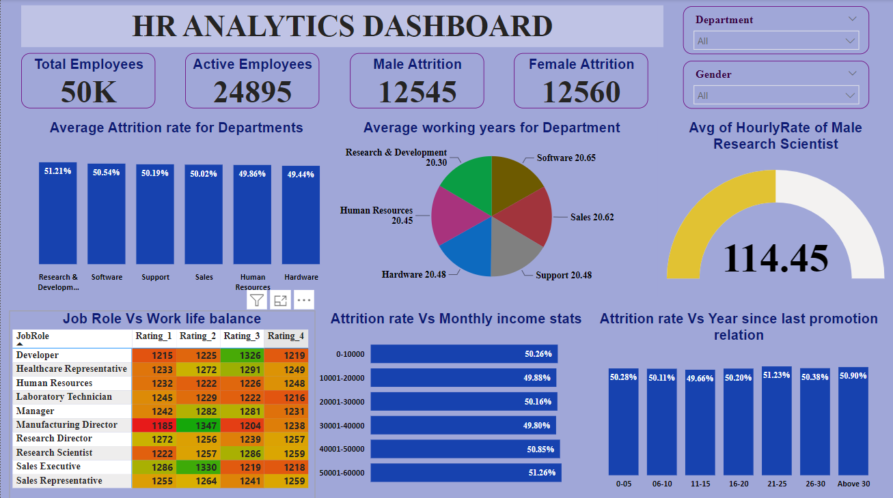

# Employee-Retention-Analytics-PowerBI

This HR Analytics dashboard provides a comprehensive overview of key performance indicators (KPIs) related to the organization's employee retention. 

The project encompassed leveraging Power Query for data extraction, transformation, and loading (ETL), complemented by robust data modeling techniques including establishing relationships between tables. DAX expressions were crafted to facilitate intricate calculations. Moreover, conditional columns were strategically incorporated to enhance data analysis capabilities. Diverse chart types were utilized to present insights visually, culminating in the development of an interactive dashboard. 

This dashboard facilitated comprehensive analysis of key metrics such as average monthly income, attrition rate, work-life balance, years since last promotion, hourly rate and working hours, stratified across various departments and job roles.

Check out the live dashboard [here](https://www.novypro.com/project/hr-analytics-dashboard-328)
